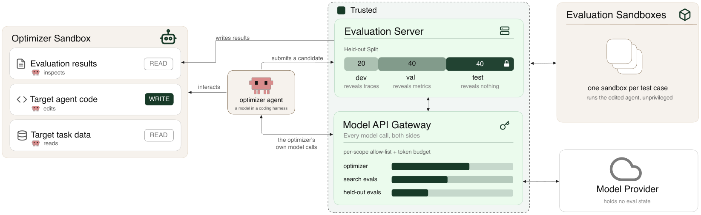

# HarnessOpt-Bench: Evaluating LLMs at Harness Optimization

[](https://arxiv.org/abs/2608.06301)
[](../LICENSE)
[](../vero/)

HarnessOpt-Bench measures how well an LLM can improve an agent harness: the
prompts, tools, control flow, memory, and orchestration code surrounding a target
model. The optimizer receives a seed harness, an evaluation budget, and limited
feedback. It edits the harness and submits a candidate for held-out evaluation.

The final result is the candidate's normalized improvement over the seed. Test
cases remain hidden from the optimizer, and every evaluated candidate is retained
for inspection.



## How a benchmark works

1. The optimizer starts from an editable seed harness.
2. It evaluates candidates on development and validation cases within a fixed
   budget.
3. It submits one candidate, which is scored on the held-out test partition.

Development results include per-case feedback. Validation exposes aggregate
scores only. Test cases and results are available only to the final evaluator.

Each benchmark pins its target, dataset, split, budgets, and scoring protocol in
`baseline/build.yaml`. That file is the source of truth.

## Benchmarks

| Benchmark | Editable target | Dataset | Split |
| --- | --- | --- | --- |
| [GAIA](gaia/baseline/) | Tool-using multimodal agent | GAIA | 20% / 40% / 40% |
| [OfficeQA](officeqa/baseline/) | Grounded document-QA agent | Treasury Bulletin corpus | 20% / 40% / 40% |
| [BrowseComp-Plus](browsecomp-plus/baseline/) | Fixed-corpus research agent | BrowseComp-Plus | 20% / 40% / 40% |
| [Terminal-Bench](terminal-bench/baseline/) | Shell-based terminal agent | Terminal-Bench 2.1 | 20% / 40% / 40% |

Additional benchmarks that were implemented but are not part of the reported
suite live under [`archive/`](archive/).

## Repository layout

Each benchmark follows the same structure:

| Path | Purpose |
| --- | --- |
| `target/` | Seed harness the optimizer may edit |
| `partitions/` | Pinned development, validation, and test case IDs |
| `baseline/build.yaml` | Complete benchmark and evaluation configuration |

The GAIA paper variant uses `target-shell/`, a deliberately minimal starting
point, instead of `target/`.

## Quick start

Install VeRO and choose a benchmark:

```bash
cd vero
uv sync --all-extras

uv run vero harbor run \
  --config ../harness-opt-bench/<benchmark>/baseline/build.yaml \
  --env-file <your>.env \
  --agent <optimizer-harness> \
  --model <optimizer-model> \
  --param optimizer_model=<optimizer-model-as-the-harness-sends-it> \
  -o ../runs/<run-name>/jobs
```

The env file holds your model-endpoint key, execution-environment tokens and
telemetry credentials; keep it outside the benchmark definition. The two model
arguments differ because some harnesses rewrite the model name before sending
it, and the gateway only accepts the name it was told to expect. The runbook,
[`skills/run-benchmark/SKILL.md`](skills/run-benchmark/SKILL.md), covers that
rule, the preflight and the health checks. Before launching a full experiment,
use [`vero/examples/harness-conformance/`](../vero/examples/harness-conformance/)
to check that a new optimizer harness and model can complete the evaluation path.

## Task data

Some task definitions are too large to store in Git. Check a fresh checkout
before running a benchmark:

```bash
python3 scripts/task_data.py --check
```

The command reports missing or incomplete data and points to the appropriate
fetch procedure. A partial download is treated as invalid because it can silently
change the evaluated case set.

## Validating a configuration

Compile a benchmark before launching a full run to validate its configuration and
inspect the generated task:

```bash
cd vero
VERO_SKIP_SECRET_CHECK=1 uv run vero harbor build \
  --config ../harness-opt-bench/<benchmark>/baseline/build.yaml \
  --output <output-directory>
```

The compiler otherwise requires every credential the benchmark declares to be
present in the environment; the variable skips that check for a compile-only run.

See [`CONFIGURATION.md`](CONFIGURATION.md) for the shared evaluation protocol,
per-benchmark values, and rules for changing a benchmark.

HarnessOpt-Bench is built on [VeRO](../vero/) and released under the repository's
[MIT license](../LICENSE).
