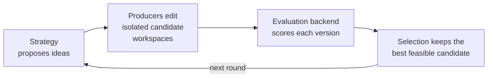
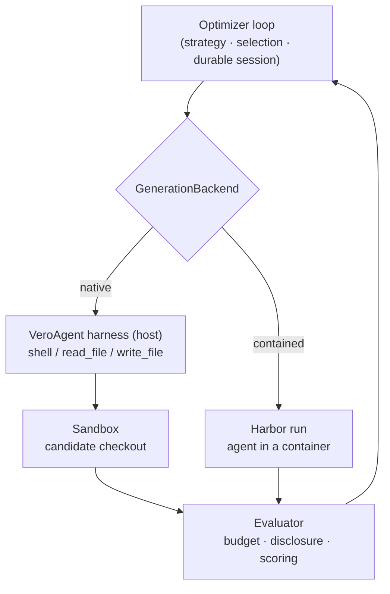

# VeRO: a harness for agents to optimize programs, text, and agents

[](https://arxiv.org/abs/2602.22480)
[](LICENSE)
[](https://www.python.org/)

VeRO gives an optimizer something to edit, a controlled way to evaluate it, and
durable memory of everything it tried. The target is anything you can put under
Git and score:

- a **program** — from a single function to a whole multi-file codebase (a
  compiler pass, a CUDA kernel, a matmul, a service);
- **text** — a prompt, specification, config, or document;
- an **agent** — its scaffold, tools, and prompts.

Agents are programs, but not everyone reads "program" that way, so VeRO calls
them out as a first-class target: it was introduced to optimize agents and
generalizes the same version / evaluate / select loop to any Git-versioned
artifact — a single file or an entire repository.

The target and evaluator do not need to be Python. VeRO's built-in command
backend communicates with an external evaluation harness through versioned JSON,
and candidate changes can come from a coding agent, an external command, or a
custom optimization strategy.



## Highlights

|  |  |
| --- | --- |
| **Any target** | a program (one function up to a whole repo), text (prompts, specs, configs), or an agent |
| **Any evaluator** | a language-neutral command harness, or Python tasks via `scale-vero-tasks` |
| **Any producer** | a coding agent (any provider via LiteLLM), an external command, or a custom strategy |
| **Real containment** | edits run in a sandbox bound to the candidate checkout; Harbor for untrusted / reproducible runs |
| **Durable & inspectable** | every candidate is versioned and re-selectable; tool calls and evaluations stream to an event log |
| **Population search** | `EvolutionaryStrategy` fans out N offspring per round with tournament selection |

> **Just want to try it?** Jump to the [Quickstart](#quickstart) — the C-matmul
> example is deterministic and needs no model credentials.

## Quickstart

Install VeRO, then try the checked-in C matrix multiplication example. Its
editable target contains only C; a trusted external harness compiles it, checks
correctness, and measures latency.

```bash
uv pip install scale-vero
cd examples/c-matmul/target
git init -b main
git add .
git -c user.name=vero -c user.email=vero@localhost commit -m baseline
cd ..

vero evaluate --config vero.toml
vero run --config vero.toml
```

The example is deterministic and needs no model credentials. VeRO evaluates the
baseline, gives an isolated worktree to the configured producer, evaluates its
commit, selects the faster feasible result, and leaves the original target
untouched. See [`examples/c-matmul`](examples/c-matmul/) for the complete target,
harness, optimizer, and config.

For a more demanding coding-agent run, use the
[`examples/circle-packing`](examples/circle-packing/) benchmark adapted from
ShinkaEvolve. It asks an agent to improve a 26-circle packing, exposes exact
geometric diagnostics and layout artifacts after each authorized evaluation,
and re-evaluates the selected candidate through a hidden final evaluation.

## Configure an optimization

`vero.toml` is the shortest path from a program to a repeatable optimization:

```toml
[target]
root = "./my-program"
ref = "HEAD"

[backend]
id = "command"
kind = "command"
harness_root = "../my-evaluator"
command = ["python3", "evaluate.py", "{workspace}", "{request}", "{report}"]

[backend.staged_inputs]
train_cases = "../my-evaluator/train.jsonl"
validation_cases = "../my-evaluator/validation.jsonl"
test_cases = "../my-evaluator/test.jsonl"

[backend.agent_context_inputs]
train = ["train_cases"]

[[evaluations]]
name = "train"
partition = "train"
agent_can_evaluate = true
agent_visible = true
agent_selection = "arbitrary"
disclosure = "full"
expose_case_resources = true

[[evaluations]]
name = "validation"
partition = "validation"
agent_can_evaluate = true
agent_visible = true
agent_selection = "arbitrary"
disclosure = "aggregate"

[evaluations.agent_budget]
total_runs = 50
total_cases = 5000

[[evaluations]]
name = "test"
partition = "test"
agent_can_evaluate = false
agent_visible = false
agent_selection = "fixed"
disclosure = "none"

[protocol]
selection_evaluation = "validation"
final_evaluation = "test"
max_proposals = 5
error_rate_threshold = 0.1

[protocol.retry]
max_attempts = 3
initial_delay_seconds = 4
maximum_delay_seconds = 120

[objective]
metric = "latency_ms"
direction = "minimize"

[[objective.constraints]]
metric = "correct"
operator = "=="
value = 1.0

[optimizer]
kind = "claude"
model = "claude-sonnet-4-5-20250929"
instruction = "Make the program faster without changing its output"

[session]
directory = "../runs/my-program"
```

Run `vero evaluate` to measure only the baseline or `vero run` to produce and
evaluate candidates. Paths are resolved relative to the config file. A target
must be a clean Git repository, while the session directory, evaluation harness,
and command producer must live outside it.

Retries wrap each individual case's inference or scoring call. By default VeRO
retries provider rate limits, HTTP 429/503/529 responses, and timeouts up to
three attempts with bounded exponential backoff. A successful retry remains a
successful case, while its earlier failed attempts are retained in the case's
structured error history. Set `max_attempts = 1` to disable retries.

An otherwise successful evaluation becomes failed when 10% or more of its
selected cases end in error; configure `protocol.error_rate_threshold` to
change that boundary. For objectives aggregated from case metrics, set
`aggregation = "mean"` (or another case aggregation) and
`case_failure_value` to assign a direction-appropriate penalty to errored,
skipped, or metric-less cases. This prevents a candidate from improving its
score by failing difficult cases.

The protocol ranks every candidate on the fixed base selection of
`validation`, regardless of which cheaper subsets the agent explored. The
agent sees only aggregate validation feedback. `test` is evaluated by the
trusted runtime after selection and never enters agent context. `train` cases
are explicitly mounted read-only because that evaluation opts into case
resources. Run `vero init` for this starter profile and `vero check` before an
expensive run.

The evaluator receives an isolated candidate workspace and paths for a
versioned request and report:

```python
# ../my-evaluator/evaluate.py
import json
import sys
from pathlib import Path

workspace = Path(sys.argv[1])
report_path = Path(sys.argv[2])

# Build, run, benchmark, call another service, etc.
latency_ms = measure(workspace)

report_path.write_text(json.dumps({
    "schema_version": 1,
    "status": "success",
    "metrics": {"latency_ms": latency_ms},
}))
```

Then choose how candidates are changed.

### Optimize with a coding agent

```bash
vero optimize ./my-program \
  --harness-root ../my-evaluator \
  --evaluate 'python3 evaluate.py {workspace} {report}' \
  --agent claude \
  --instruction 'Make the program faster without changing its output' \
  --metric latency_ms \
  --direction minimize \
  --max-proposals 5
```

Use `--agent vero` for VeRO's OpenAI Agents SDK implementation. It runs on any
provider via LiteLLM; its harness runs on the host while its shell and file
edits execute inside a sandbox bound to the candidate checkout (see [Safety
boundaries](#safety-boundaries)). In `vero.toml`, `optimizer.model` selects an
explicit model identifier; for the `vero` agent you can also set it via the
`VERO_OPTIMIZER_MODEL` environment variable, and omitting both preserves the
adapter's default. Provider-specific dependencies and credentials are required
for either built-in coding agent. For a contained/untrusted producer, run the
agent through Harbor (see [`examples/harbor-circle-packing`](examples/harbor-circle-packing/)).

### Optimize with any external producer

An external producer receives an isolated workspace and edits it in place:

```bash
vero optimize ./my-program \
  --harness-root ../my-evaluator \
  --evaluate 'python3 evaluate.py {workspace} {report}' \
  --producer-root ../my-optimizer \
  --produce 'python3 improve.py {workspace}' \
  --metric latency_ms \
  --direction minimize
```

Commands are parsed into argument vectors, not executed through a shell. Use
absolute executable paths when the executable is not on the standard system
`PATH`. Available evaluation placeholders are `{workspace}`, `{request}`,
`{report}`, `{artifacts}`, and `{harness}`. External producers additionally get
`{producer}` and `{context}`; `VERO_CONTEXT_PATH` contains the same context path.
The harness and producer roots resolve to staged sandbox paths when the target
is not host-visible.

`staged_inputs` are trusted evaluator inputs available to the evaluation
command through `{input:NAME}` placeholders. They remain hidden from candidate
producers unless their names are also explicitly listed in
`agent_context_inputs` for a specific named evaluation, as in the example
above. This per-evaluation allowlist prevents exposing a test input merely
because train and test share one command backend.

The flag-based `vero optimize` command exposes the same objective constraints,
case selection, target ref, timeouts, environments, and concurrency controls;
run `vero optimize --help` for the full surface.

## Track runs with Weights & Biases

Install the optional integration and add a section to `vero.toml`:

```bash
uv pip install 'scale-vero[wandb]'
```

```toml
[wandb]
project = "program-optimization"
entity = "my-team"       # optional
name = "matmul-v1"       # optional
mode = "online"          # online, offline, or disabled
tags = ["c", "latency"]
```

Each VeRO session maps to a stable W&B run. It logs canonical report metrics,
objective value and feasibility, case counts, candidate and evaluation IDs, and
the final baseline/best summary. Resuming the VeRO session resumes the same W&B
run. The direct CLI equivalent is `--wandb-project`, with optional entity, name,
and mode flags.

## Python API

The same pipeline can be assembled from backend-neutral interfaces:

```python
from pathlib import Path

from vero.evaluation import (
    CommandBackend,
    CommandBackendConfig,
    EvaluationPlan,
    EvaluationSet,
    MetricSelector,
    ObjectiveSpec,
)
from vero.optimization import (
    CommandCandidateProducer,
    CommandCandidateProducerConfig,
)
from vero.runtime import create_local_optimization_session
from vero.sandbox import LocalSandbox

backend = CommandBackend(CommandBackendConfig(
    harness_root=str(Path("../my-evaluator").resolve()),
    command=["python3", "evaluate.py", "{workspace}", "{report}"],
))
producer = CommandCandidateProducer(CommandCandidateProducerConfig(
    root=str(Path("../my-optimizer").resolve()),
    command=["python3", "improve.py", "{workspace}"],
))

session = await create_local_optimization_session(
    project_path="./my-program",
    session_dir="~/.vero/sessions/my-run",
    backend_id="command",
    backend=backend,
    objective=ObjectiveSpec(
        selector=MetricSelector(metric="latency_ms"),
        direction="minimize",
    ),
    evaluation_plan=EvaluationPlan.single(EvaluationSet(name="performance")),
    producers={"default": producer},
    max_proposals=5,
)
result = await session.run()
print(result.best.request.candidate.version, result.best.objective.value)

# Every candidate remains available after its producer workspace is gone.
inspection_sandbox = await LocalSandbox.create()
for candidate in session.candidate_repository.list():
    async with session.candidate_repository.checkout(
        candidate,
        sandbox=inspection_sandbox,
        name=f"inspect-{candidate.id}",
    ) as candidate_workspace:
        print(candidate.id, candidate_workspace.project_path)
```

`vero session inspect SESSION_DIR` includes the same durable candidate records
alongside the manifest and evaluation summaries.

### Run the target in a remote sandbox

The local factory above is a convenience wrapper. For containers, remote VMs,
or another execution environment, provision a `Workspace` in that sandbox and
pass it to the generic factory:

```python
from vero.runtime import create_optimization_session
from vero.candidate_repository import GitCandidateRepository
from vero.sandbox import DockerSandbox
from vero.workspace import GitWorkspace

sandbox = await DockerSandbox.create(image="gcc:14-bookworm")
try:
    # The repository is copied into the container; it is not bind-mounted.
    await sandbox.upload("./my-program", "/workspace/my-program")
    workspace = await GitWorkspace.from_path(
        sandbox,
        "/workspace/my-program",
    )
    session_dir = Path("~/.vero/sessions/remote-run").expanduser()
    candidate_repository = await GitCandidateRepository.create(
        session_dir / "candidates",
        workspace=workspace,
    )

    backend = CommandBackend(CommandBackendConfig(
        harness_root=str(Path("../my-evaluator").resolve()),
        command=[
            "sh",
            "{harness}/evaluate.sh",
            "{workspace}",
            "{report}",
            "{artifacts}",
        ],
    ))
    producer = CommandCandidateProducer(CommandCandidateProducerConfig(
        root=str(Path("../my-optimizer").resolve()),
        command=["sh", "{producer}/improve.sh", "{workspace}"],
    ))
    session = await create_optimization_session(
        workspace=workspace,
        candidate_repository=candidate_repository,
        session_dir=session_dir,
        backend_id="command",
        backend=backend,
        objective=ObjectiveSpec(
            selector=MetricSelector(metric="latency_ms"),
            direction="minimize",
        ),
        producers={"default": producer},
    )
    result = await session.run()
finally:
    await sandbox.close()
```

Session manifests, databases, budgets, W&B logging, artifacts, and the bare Git
candidate repository stay on the host. Candidate commands, compilation, and
evaluation run in isolated checkouts inside the sandbox. VeRO transfers Git
bundles between remote checkouts and the durable repository, then removes each
temporary checkout after use.

Remote command harnesses and producer directories must be self-contained. An
executable named in a command must either be installed in the sandbox or live
under `{harness}` or `{producer}`. `ClaudeCodeAgent` requires a host-visible
workspace because its SDK takes a local `cwd`; `VeroAgent` and custom agents
whose tools operate through `Sandbox` can work without one. Incompatible agents
are rejected when the session is created.

### Python benchmark tasks

Python targets can use the optional `scale-vero-tasks` package instead of
writing the JSON command contract directly. It provides only task definition
and execution types; target programs do not depend on the VeRO optimizer.

```python
# ../my-evaluator/benchmark.py
from vero_tasks import TaskOutput, TaskResult, create_task
from my_program import run_program

task = create_task("quality")

@task.inference()
async def run(case, context):
    return TaskOutput(output=run_program(case["input"]))

@task.evaluation()
async def score(case, output, context):
    return TaskResult.from_task_output(
        output,
        score=float(output.output == case["expected"]),
    )
```

Connect it with `PythonTaskBackend`. Keep the task module and cases in a trusted
external uv project; VeRO overlays each isolated candidate with
`uv --with-editable` so the harness imports the exact program version being
measured without making evaluator code editable.

```python
from vero.evaluation import (
    PythonTaskBackend,
    PythonTaskBackendConfig,
    PythonTaskEvaluationConfig,
)

backend = PythonTaskBackend(PythonTaskBackendConfig(
    harness_root=str(Path("../evaluation-state").resolve()),
    module="benchmark",
    task="quality",
    evaluations=[
        PythonTaskEvaluationConfig(
            name="train",
            partition="train",
            cases_path=str(Path("../train.jsonl").resolve()),
        ),
        PythonTaskEvaluationConfig(
            name="validation",
            partition="validation",
            cases_path=str(Path("../validation.jsonl").resolve()),
        ),
    ],
))
```

### Harbor tasks

Harbor is also an evaluation backend, rather than a separate optimization
runtime. Map each `EvaluationSet` case to one Harbor task and pin the Harbor
package used to orchestrate the nested run:

```json
{"id": "task-1", "task_name": "org/terminal-task-1"}
{"id": "task-2", "task_name": "org/terminal-task-2"}
```

```python
from vero.harbor import HarborBackend, HarborBackendConfig

backend = HarborBackend(HarborBackendConfig(
    task_source="org/terminal-benchmark@1.0",
    agent_import_path="my_program.agent:Agent",
    cases_path=str(Path("../harbor-cases.jsonl").resolve()),
    harbor_requirement="harbor[modal]==0.18.0",
    evaluation_set_name="terminal-benchmark",
    partition="test",
    passthrough_environment=["ANTHROPIC_API_KEY"],
))
```

VeRO invokes `harbor run` without importing Harbor into the core library,
collates verifier rewards into schema-v1 case results, zero-fills dead attempts
for mean aggregation, and preserves Harbor output as evaluation artifacts. The
pinned Harbor overlay protects against a candidate changing its dependency pin;
it is not a process isolation boundary because candidate code still runs inside
the nested Harbor process. The sidecar isolates the optimizer process and keeps
budget/finalization state trusted, but it does not by itself contain malicious
target code loaded by the nested runner. When targets are adversarial, execute
them in a separate sandbox that cannot read verifier data or credentials.

For optimization-as-a-Harbor-task, `EvaluationSidecar` exposes the same engine
across a process boundary. `SidecarEvaluationPolicy` maps each backend and
evaluation-set partition to canonical full, aggregate, or acknowledgement-only
disclosure; the canonical budget ledger meters agent calls. The sidecar can
host several backends at once. `GitCandidateTransport` imports agent commits
under durable trusted refs, and `CanonicalVerifier` selects and re-scores a
candidate before producing Harbor rewards. Hidden final evaluations use the
same backend contracts with unmetered admin authorization, so this deployment
does not introduce a parallel evaluation model.

Install the optional server dependencies with `scale-vero[harbor]`. A sidecar
image provides a trusted `module:factory` callable that accepts its JSON config
and returns `SidecarComponents`; start it with:

```bash
vero harbor serve \
  --factory trusted_deployment:build_components \
  --config /etc/vero/sidecar.json \
  --admin-token /shared/admin-token
```

The optimizer uses `vero harbor eval --detach`, `eval-status`, `eval-result`,
`status`, and `submit` through `VERO_EVAL_URL`. Detached evaluations are durable
session jobs: their candidate version is captured before the start command
returns, their lifecycle appears in `status`, and their terminal receipt remains
retrievable if the original client exits. Plain `vero harbor eval` remains a
blocking compatibility shortcut. Harbor's trusted verifier uses `vero harbor
finalize` with the root-readable token file and writes only the final reward
mapping to `reward.json`.

The built-in Harbor compiler supplies that factory and container topology for
nested Harbor evaluations. A minimal build file looks like:

```yaml
name: example/optimize-agent
agent_repo: ../my-program
task_source: example/terminal-benchmark@1.0
agent_import_path: my_program.agent:Agent
harbor_requirement: harbor[modal]==0.18.0
environment_name: modal
secrets: [MODAL_TOKEN_ID, MODAL_TOKEN_SECRET]
inference_gateway:
  upstream_api_key_env: OPENAI_API_KEY
  upstream_base_url_env: OPENAI_BASE_URL
  producer:
    allowed_models: [gpt-5]
  evaluation:
    allowed_models: [gpt-5-mini]
    max_requests: 5000
    max_tokens: 20000000

partitions:
  validation: [example/task-a, example/task-b, example/task-c,
               example/task-d, example/task-e]
  test: [example/task-hidden]

agent_access:
  - partition: validation
    disclosure: aggregate
    expose_case_resources: false
    total_runs: 10
    total_cases: 50

selection_partition: validation
targets:
  - partition: test
    reward_key: reward
```

Compile it with `vero harbor build --config build.yaml --output task`. The
`environment_name` selects Modal for each nested evaluation. `secrets` are
sidecar-only environment references and are explicitly removed from the
optimizer container. The inference gateway runs as a third, trusted service:
it alone receives the upstream provider credential. The optimizer receives a
producer-scoped token with no default request or token ceiling, while candidate
evaluations receive an independently budgeted evaluation token and a URL
attributed to the evaluation ID.
For a real optimization, use the VeRO launcher so provider credentials are
renamed for the gateway before Harbor constructs the coding agent:

```bash
vero harbor run \
  --config build.yaml \
  --environment modal \
  --agent codex \
  --model openai/gpt-5
```

Do not invoke `harbor run` directly for a gateway-enabled build: Harbor coding
agent adapters otherwise discover the upstream provider credential from their
own host process before entering the task container.

The gateway implements the Responses, Chat Completions, and Embeddings HTTP
surfaces, restricts each scope to configured models, and records requests and
provider-reported token usage durably. Request and token limits are optional per
scope; omit them to record usage without enforcing a ceiling. `vero harbor
status` includes used inference and any configured remaining budgets. Request
limits are exact; token limits stop the next request after reported usage
reaches the limit, so already accepted concurrent responses can cross a token
boundary.

Evaluation case budgets are cumulative rather than per-run. An agent may spend
its entire remaining case budget in one authorized evaluation; deciding between
wide measurements and more iterations is part of its optimization strategy.

`case_timeout_seconds` is an absolute VeRO limit for the Harbor agent phase.
Because Harbor applies task timeouts through a multiplier, set
`task_agent_timeout_seconds` to the agent timeout declared by the pinned task
source. The compiler passes their ratio as Harbor's agent-timeout multiplier;
for example, `180 / 600 = 0.3`. This leaves verifier and environment setup
timeouts unchanged.

Finalization closes the agent evaluation entrance and waits for every request
the sidecar already accepted before selecting a candidate. This includes an
evaluation launched from a background shell, so ending the optimizer process
cannot race a still-running validation measurement. The compiled deployment's
`evaluation_drain_timeout_seconds` defaults to `timeout_seconds`; after that
bounded wait, VeRO cancels the unfinished evaluation through the normal durable
cancellation and budget-refund path. Trusted verifier evaluations remain
available after the agent entrance closes.

Because Harbor verification uses the shared environment, the verifier exports
the complete sidecar session before teardown. Successful runs contain
`session.tar.gz`, `session.tar.gz.sha256`, `experiment.html`, `status.json`, and
`finalization.json` under the verifier artifacts. The archive contains the bare
candidate Git repository, canonical evaluation records and artifacts, budget
state, finalization result, and an available producer trajectory. Export or
report-generation failure fails verification rather than silently deleting the
only durable copy with an ephemeral environment.

The test partition and task source exist only in the sidecar image; the optimizer
container receives the editable baseline, the agent-facing CLI, and approved
result projections. Exact Harbor and registry task-source versions are required
so the measurement substrate is reproducible.

Agent-triggered and system-triggered evaluations use independent budgets.
Reservations for cancelled runs or execution failures are durably refunded;
completed failure reports remain measurements and stay charged. Harbor retries
whole-run infrastructure failures and surfaces exhausted outages separately so
they fail the session instead of becoming candidate regressions. Aggregate
validation is optimization data, not a privacy guarantee: arbitrary subsets are
allowed by default, while the separate final evaluation remains unreachable.
The generated shared-container topology protects the admin credential with
Unix ownership and permissions. It assumes candidate code cannot gain root in
that container; higher-assurance deployments should keep finalization
credentials outside the candidate workbench entirely.

The inference boundary protects provider credentials, not infrastructure
credentials. A Harbor controller using Modal still needs Modal authorization;
arbitrary target code imported into that controller is not isolated from its
OS process. Use a separately sandboxed runner or infrastructure broker when
target programs themselves are adversarial.

`EvaluationBackend`, `CandidateProducer`, `OptimizationStrategy`, and
`SelectionPolicy` are protocols. Implement them to connect a remote evaluator,
a non-Git version store, an evolutionary search algorithm, or an orchestrator
that delegates proposals to several specialized producers.

## Core concepts

Production is a swappable `GenerationBackend`: the native in-process producer (a
coding agent whose harness runs on the host while its edits run in a sandbox), or
a Harbor run (the whole agent contained). Either way the orchestrator evaluates,
selects, and remembers — separately from the feedback the producer saw.



| Concept | Meaning |
| --- | --- |
| `Candidate` | A target identity (a program, text, or agent) plus an opaque workspace version and lineage |
| `EvaluationSet` | A backend-owned collection or selection of evaluation cases |
| `EvaluationPlan` | Named evaluations, agent access, independent budgets, canonical selection, and optional hidden final evaluation |
| `EvaluationRecord` | The durable request, report, provenance, and objective result |
| `EvaluationBackend` | Measures a candidate without assuming its language or framework |
| `CandidateProducer` | Edits one isolated workspace to realize a proposed idea |
| `GenerationBackend` | Produces candidates plus their generation-time feedback for a proposal — the swappable unit that is the in-process native producer by default or a Harbor run |
| `OptimizationStrategy` | Chooses parents, ideas, and producers for the next batch (e.g. `SequentialStrategy`, or `EvolutionaryStrategy` for population/tournament search) |
| `SelectionPolicy` | Chooses the best feasible evaluation for the configured objective |
| `OptimizationSession` | Owns lifecycle, events, artifacts, budgets, and durable state |

Coding agents receive a scoped `AgentContext`. They can edit only their supplied
workspace and call `evaluate(evaluation=..., selection=..., candidate_id=...)`.
The current workspace is saved as a candidate when `candidate_id` is omitted;
supplying an existing candidate ID re-evaluates that durable version. The tool
returns a compact receipt with the evaluation ID, status, approved summary, and
path to the filesystem result. Large case records, traces, and artifacts stay
out of the tool response. Intermediate checkpoints are real candidates and
remain eligible for selection, even if the agent later makes the program worse.

Each producer workspace contains a generated, read-only `.vero/` directory:

```text
.vero/
├── README.md
├── manifest.json
├── evaluations.json # available evaluations, selections, disclosure, budgets
├── cases/          # only backend-approved case resources
├── candidates/     # metadata, parent patches, and repository-native refs
└── evaluations/    # authorized summaries or full case/trace/artifact trees
```

The agent can inspect this with ordinary filesystem and Git commands. Full
evaluation disclosure splits potentially long traces into separate files;
aggregate disclosure includes only aggregate metrics and counts; none includes
only status. Candidate history includes durable Git refs, so siblings do not
need to be ancestors of the current checkout. A proposal sees the candidates
from the start of its generation, then immediately sees its own evaluated
checkpoints. Parallel siblings become visible in the next generation.

The directory is excluded from Git, protected by workspace read rules and file
permissions, and rejected if a candidate force-adds it anyway. Its contents are
a disposable view: durable candidate and evaluation stores remain the trusted
source. In Harbor, the sidecar owns the writable volume and the coding-agent
container mounts the same directory read-only. Case resources are exported only
when the evaluation authorization explicitly permits them and the backend
provides a safe export. For Harbor datasets, an authorized partition contains
the complete pinned task directories and dataset-level files—not merely case
identifiers. Full-disclosure Harbor evaluations also expose the complete
downloaded trial record for every successful or failed case, including exact
failure results, exception tracebacks, trial logs, and target-agent artifacts;
aggregate projections expose neither case records nor their trial artifacts.

Strategies can propose a batch of candidates and route each proposal to a named
producer. Set `max_concurrency` to produce and evaluate independent candidates in
parallel. This supports sequential hill climbing, evolutionary search, and
orchestrator/sub-agent designs without changing the evaluation model.

## Durable sessions

Session state is stored outside the target repository:

```text
sessions/<session-id>/
├── manifest.json
├── database.json
├── budgets.json          # when evaluation is metered
├── events.jsonl
├── artifacts/
└── evaluations/
    └── <evaluation-id>/
        ├── evaluation.json
        ├── cases/
        └── artifacts/
```

The evaluation directories are the source of truth; the database can be rebuilt
from them. Reusing a session directory resumes its compatible baseline,
candidate lineage, evaluation history, completed rounds, and supported coding
agent state. VeRO rejects a resume if its backend configuration, evaluation
plan, run protocol, parameters, limits, seed, objective, or baseline is
incompatible with the schema-v3 manifest.

```bash
vero session list
vero session inspect ~/.vero/sessions/<session-id>
vero report ~/.vero/sessions/<session-id> --output experiment.html
vero session fork OLD_SESSION NEW_SESSION --max-proposals 20 --reset-budgets
vero session export ~/.vero/sessions/<session-id>
vero session clear ~/.vero/sessions/<session-id> --yes
```

`vero report` creates a self-contained, read-only HTML view of the whole run:
the score trajectory, candidate lineage and parent diffs, evaluation artifacts,
producer traces, and runtime event timeline. The report embeds those materials,
so treat the resulting file as sensitive experiment data.

## Safety boundaries

- Candidate changes happen in isolated Git worktrees; the original target is not
  edited.
- The target must be clean so its baseline has an unambiguous version.
- Session state, evaluation harnesses, and external producers must live outside
  the editable target repository.
- Command execution uses argument vectors and an explicit environment.
- Evaluation secrets are passed through backend configuration and redacted from
  diagnostics; they cannot be embedded in evaluation parameters.
- Agent-visible cases, histories, and evaluation details are projected into a
  generated `.vero/` view according to the same authorization boundary.
- Budgets are reserved atomically before backend execution.
- A built-in coding agent's shell and file actions execute inside a sandbox
  bound to its candidate checkout, so containment is the sandbox boundary rather
  than in-process checks. The local sandbox is for fast, trusted runs; for a
  contained or untrusted producer run the agent through Harbor, which isolates
  the agent (and, in separate-verifier mode, the scorer) in its own environment.

## Paper and reproduction

VeRO was introduced in [*VeRO: A Harness for Agents to Optimize
Agents*](https://arxiv.org/abs/2602.22480), accepted at ICML 2026. The paper
studies agent-harness optimization; the current library generalizes the same
version/evaluate/select loop to programs more broadly.

The frozen code for reproducing the paper is preserved on the `paper/v1` branch
and at the `paper-v1` tag:

```bash
git checkout paper-v1
```

## Development

```bash
uv sync --all-extras
uv run pytest tests/test_v05_*.py
```

VeRO is licensed under the MIT License.
