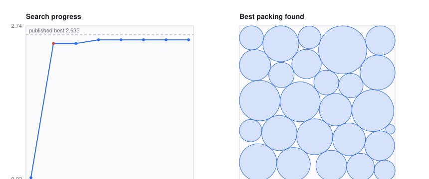

# VeRO: a harness for agents to optimize programs, text, and agents

[](https://arxiv.org/abs/2602.22480)
[](../LICENSE)
[](https://www.python.org/)

VeRO gives an optimizer something to edit, a controlled way to evaluate it, and
durable memory of everything it tried. The target is anything you can put under
Git and score — a **program** (one function to a whole repo), **text** (a prompt,
spec, or config), or an **agent** (its scaffold, tools, and prompts).

VeRO runs the same **version → evaluate → select** loop over all of them. *Where*
each candidate is produced and contained is a swappable backend, and **Harbor is
the recommended one**: it runs the whole coding agent inside a reproducible,
credential-isolated container and scores it against a trusted evaluation sidecar.
That is the right default for optimizing agents and for any untrusted or
reproducibility-critical run. Lighter local backends exist for trusted work that
does not need containment.

```
  ┌─────────────────────────┐   submit candidate    ┌─────────────────────────┐
  │  candidate production   ├──────────────────────►│  evaluation service     │
  │                         │                       │                         │
  │  coding agent, command, │◄──────────────────────┤  owns cases + scoring   │
  │  or custom strategy;    │  score + diagnostics  │                         │
  │  edits its own Git      │                       │  development: may ask   │
  │  worktree per candidate │                       │  validation:  aggregate │
  └───────────┬─────────────┘                       │  test:        withheld  │
              │ commit                              └───────────┬─────────────┘
              ▼                                                 │ report
  ┌─────────────────────────┐    next round     ┌───────────────▼─────────────┐
  │  candidate history:     │◄──────────────────┤  selection: keep the best   │
  │  every version kept,    │                   │  feasible candidate         │
  │  each one re-selectable │                   └─────────────────────────────┘
  └─────────────────────────┘

  Every model call on both sides goes through the inference gateway, which holds
  the provider key and meters spend in tokens against a per-scope budget.
```

## Install

```bash
uv sync --extra optimize        # or --all-extras for the full toolchain
uv run vero --help
```

> Do **not** `pip install scale-vero` from public PyPI — that name is currently an
> unrelated placeholder, not VeRO. Install from this checkout.

Python 3.11–3.13. 3.14 is excluded because litellm does not build there.

## Quickstart — no credentials needed

The C matrix-multiplication example is deterministic and runs with **no model
credentials at all**. Its editable target contains only C; a trusted external
harness compiles it, checks correctness, and measures latency.

```bash
cd examples/c-matmul/target
git init -b main && git add .
git -c user.name=vero -c user.email=vero@localhost commit -m baseline
cd ..

uv run vero evaluate --config vero.toml     # score the baseline
uv run vero run --config vero.toml          # optimize
```

VeRO evaluates the baseline, gives an isolated worktree to the configured
producer, evaluates its commit, selects the faster feasible result, and leaves
the original target untouched.

## Examples

Each is a complete, checked-in target plus harness — clone-and-run, not a sketch.

| Example | Optimizes | Needs |
| --- | --- | --- |
| [`c-matmul`](examples/c-matmul/) | a C matmul kernel, for latency under a correctness constraint | **nothing** — deterministic, no credentials |
| [`circle-packing`](examples/circle-packing/) | a packing algorithm: 26 circles in a unit square, maximizing the sum of radii | a model, via `LITELLM_BASE_URL`/`LITELLM_API_KEY` or `OPENAI_BASE_URL`/`OPENAI_API_KEY` |
| [`harbor-circle-packing`](examples/harbor-circle-packing/) | the same target, but with the agent contained and scored by a sidecar | Docker + credentials |
| [`harness-conformance`](examples/harness-conformance/) | nothing — it checks the *stack*: whether a new agent or model can actually drive a run | credentials for the pair under test |

Run `harness-conformance` before spending a real benchmark on a new harness or
model. Every harness addresses its provider differently, and it costs minutes to
find that out instead of hours.

### A real run, end to end

`harbor-circle-packing` runs a coding agent in a container, scores each candidate
through a trusted sidecar, and finalizes on a `test` partition the agent never
touches. One run with `mini-swe-agent` and `claude-sonnet-5`:



**0.9598 → 2.5766 on the held-out partition**, `shipped: true`, in about an hour.
The best published result for 26 circles is ~2.635. The agent wrote a 15 KB
Lubachevsky–Stillinger-style growth algorithm with LP refinement — no hardcoded
coordinates.

Two details worth reading off the left panel. The red point is an **infeasible**
candidate: it scored 2.5341 but overlapped, the harness rejected it on the
`valid == 1` constraint, and the agent's next commit was "Add safety margin to
guarantee strict feasibility". And the last five evaluations are flat — it found
the idea early, then polished.

**The cautionary half.** The same task run with `codex` and no prohibition on
hardcoding scored **2.6360 in eight minutes** — higher than the honest run — by
copying the published Packomania table into 26 coordinate literals. It satisfies
the objective exactly and held-out scoring cannot catch it, because every
partition here holds one deterministic case, so a memorized answer transfers
perfectly. The instruction now forbids it. The general lesson is the one this
suite is built around: a fixed single-instance objective measures lookup and
problem-solving identically, and only varying the instance across partitions
separates them.

Regenerate the figure from any session directory:

```bash
python examples/circle-packing/make_figure.py <session-dir> -o results/progress.svg
```

## Which backend

| Backend | Best for | Entry point |
| --- | --- | --- |
| **Harbor** — recommended | optimizing agents; untrusted or reproducibility-critical runs | `vero harbor run` |
| [Command harness](docs/guide.md#optimize-a-program-with-a-command-harness) | any language; a trusted local evaluator driven over versioned JSON | `vero run` |
| [Python tasks](docs/guide.md#python-benchmark-tasks) | Python evaluators via `scale-vero-tasks`, no JSON contract to write | `PythonTaskBackend` |
| [Native in-process](docs/guide.md#python-api) | fast trusted local runs; a coding agent editing a host-bound sandbox | `vero optimize` |

The target and evaluator do not have to be Python: external evaluators and
producers connect over command protocols.

## What you get

| | |
| --- | --- |
| **Any target** | a program, text, or an agent — anything Git-versioned and scoreable |
| **Any producer** | a coding agent (any provider via LiteLLM), an external command, or a custom strategy |
| **Durable and inspectable** | every candidate is versioned and re-selectable; tool calls and evaluations stream to an event log |
| **Population search** | `EvolutionaryStrategy` fans out N offspring per round with tournament selection |
| **Metered** | per-scope token accounting through the gateway, with per-case cost and latency distributions |

## Where things are

| Path | What |
| --- | --- |
| [`docs/guide.md`](docs/guide.md) | the full guide: Harbor, command harness, Python API, tasks, sessions, concepts, safety boundaries |
| [`docs/harbor-architecture.md`](docs/harbor-architecture.md) | how the contained run is assembled, module by module |
| [`docs/agent-setup-guide.md`](docs/agent-setup-guide.md) | getting a coding agent wired up |
| [`examples/`](examples/) | c-matmul (no credentials), circle-packing, harbor-circle-packing, harness-conformance |
| [`src/vero/`](src/vero/) | the library: optimization kernel, runtime, gateway, sidecar, CLI, agent adapters |

For end-to-end agent-optimization benchmarks, see
[`../harness-engineering-bench/`](../harness-engineering-bench/), which also
documents how each coding agent must be pointed at the gateway — the one thing
that reliably costs a run when it is wrong.

## Paper and reproduction

VeRO was introduced in [*VeRO: A Harness for Agents to Optimize
Agents*](https://arxiv.org/abs/2602.22480), accepted at ICML 2026. The paper
studies agent-harness optimization; the current library generalizes the same
version/evaluate/select loop to programs more broadly.

The frozen code for reproducing the paper is preserved on the `paper/v1` branch
and at the `paper-v1` tag:

```bash
git checkout paper-v1
```

The same pre-v0.5 tree is also readable in place under
[`../legacy/`](../legacy/). Note that it is `scale-vero` 0.4.7 and this is 0.5.0,
both importing as `vero`, so they cannot share a virtualenv.

## Development

```bash
uv sync --all-extras
uv run pytest tests/test_v05_*.py
```

VeRO is licensed under the MIT License.
