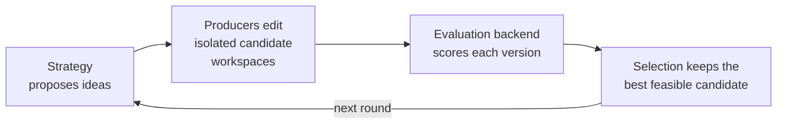
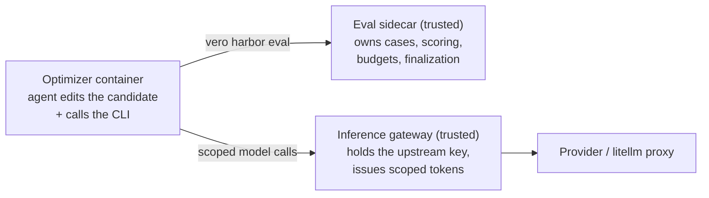
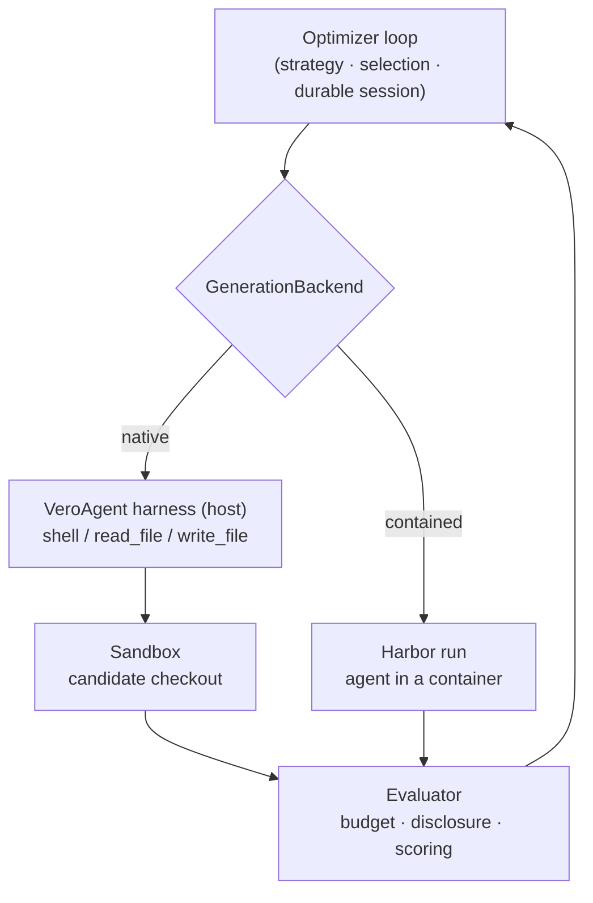

# VeRO: a harness for agents to optimize programs, text, and agents

[](https://arxiv.org/abs/2602.22480)
[](LICENSE)
[](https://www.python.org/)

VeRO gives an optimizer something to edit, a controlled way to evaluate it, and
durable memory of everything it tried. The target is anything you can put under
Git and score — a **program** (one function to a whole repo), **text** (a prompt,
spec, or config), or an **agent** (its scaffold, tools, and prompts).

VeRO runs the same **version → evaluate → select** loop over all of them. *Where*
each candidate is produced and contained is a swappable backend — and
**[Harbor](#optimize-an-agent-with-harbor) is the recommended one**: it runs the
whole coding agent inside a reproducible, credential-isolated container and scores
it against a trusted evaluation sidecar. That's the right default for optimizing
agents and for any untrusted or reproducibility-critical run. Lighter local
backends (a language-neutral command harness, Python tasks) are there for trusted
work that doesn't need containment.



## Highlights

|  |  |
| --- | --- |
| **Harbor-first containment** | run the whole agent in a reproducible container against a trusted eval sidecar, behind a credential-isolating inference gateway — the recommended backend |
| **Any target** | a program (one function up to a whole repo), text (prompts, specs, configs), or an agent |
| **Any producer** | a coding agent (any provider via LiteLLM), an external command, or a custom strategy |
| **Durable & inspectable** | every candidate is versioned and re-selectable; tool calls and evaluations stream to an event log |
| **Population search** | `EvolutionaryStrategy` fans out N offspring per round with tournament selection |

## Backends

VeRO separates *what* it optimizes from *how* candidates are produced and scored.
Start with Harbor; drop to a lighter backend when you don't need containment.

| Backend | Best for | Entry point |
| --- | --- | --- |
| **[Harbor](#optimize-an-agent-with-harbor)** — recommended | optimizing agents; untrusted or reproducibility-critical runs. Runs the whole agent in a container against a trusted eval sidecar, with a credential-isolating inference gateway. | `vero harbor run` |
| [Command harness](#optimize-a-program-with-a-command-harness) | any language; a trusted local evaluator you drive over versioned JSON | `vero run` |
| [Python tasks](#python-benchmark-tasks) | Python evaluators via `scale-vero-tasks`, no JSON contract to write | `PythonTaskBackend` |
| [Native in-process](#python-api) | fast trusted local runs; a coding agent whose edits execute in a host-bound sandbox | `vero optimize` |

**Harbor in one command** — compile a build file into a contained task and run an
agent against it, with secrets kept off the command line:

```bash
vero harbor run \
  --config build.yaml \
  --agent claude-code --model claude-sonnet-4-6 \
  --env-file secrets.env
```

See [Optimize an agent with Harbor](#optimize-an-agent-with-harbor) for the build
file, the inference gateway, and how disclosure and budgets are enforced.

> **Just want to kick the tires first?** The [Quickstart](#quickstart) C-matmul
> example is deterministic and needs no model credentials.

## Quickstart

Install VeRO, then try the checked-in C matrix multiplication example. Its
editable target contains only C; a trusted external harness compiles it, checks
correctness, and measures latency.

```bash
# Install VeRO from this checkout. Do NOT `pip install scale-vero` from public
# PyPI — that name is currently an unrelated placeholder, not VeRO.
uv sync --extra optimize

cd examples/c-matmul/target
git init -b main
git add .
git -c user.name=vero -c user.email=vero@localhost commit -m baseline
cd ..

uv run vero evaluate --config vero.toml
uv run vero run --config vero.toml
```

The example is deterministic and needs no model credentials. VeRO evaluates the
baseline, gives an isolated worktree to the configured producer, evaluates its
commit, selects the faster feasible result, and leaves the original target
untouched. See [`examples/c-matmul`](examples/c-matmul/) for the complete target,
harness, optimizer, and config.

For a more demanding coding-agent run, use the
[`examples/circle-packing`](examples/circle-packing/) benchmark adapted from
ShinkaEvolve. It asks an agent to improve a 26-circle packing, exposes exact
geometric diagnostics and layout artifacts after each authorized evaluation,
and re-evaluates the selected candidate through a hidden final evaluation.

## Optimize an agent with Harbor

Harbor is VeRO's recommended backend for optimizing agents. Each candidate runs
as a **contained agent**, scored by a **trusted sidecar**, with provider
credentials held by a **separate gateway** the agent never sees:



Two steps: **build** a contained task from a YAML file, then **run** an agent
against it.

### 1. The build file

`build.yaml` declares the target repo, the task source and case partitions, what
the agent may evaluate, and the inference gateway:

```yaml
name: example/optimize-agent
agent_repo: ../my-program                       # editable target (a Git repo)
task_source: example/terminal-benchmark@1.0     # pinned registry tasks
agent_import_path: my_program.agent:Agent
harbor_requirement: harbor[modal]==0.20.0
environment_name: modal                         # where each nested eval runs
secrets: [MODAL_TOKEN_ID, MODAL_TOKEN_SECRET]   # sidecar-only; stripped from the agent

inference_gateway:
  upstream_api_key_env: OPENAI_API_KEY
  upstream_base_url_env: OPENAI_BASE_URL
  producer:                                     # the optimizer's scope
    allowed_models: [gpt-5]
  evaluation:                                   # the target's scope
    allowed_models: [gpt-5-mini]
    max_requests: 5000
    max_tokens: 20000000

partitions:
  validation: [example/task-a, example/task-b, example/task-c]
  test: [example/task-hidden]

agent_access:                                   # what the agent may evaluate, and how much it sees
  - partition: validation
    disclosure: aggregate                       # full | aggregate | none
    total_runs: 10
    total_cases: 50

selection_partition: validation                 # candidates are ranked here
targets:
  - partition: test                             # held-out; trusted verifier scores it after selection
    reward_key: reward
```

| Knob | What it controls |
| --- | --- |
| `agent_access[].disclosure` | how much of an evaluation the agent sees: `full` (per-case traces), `aggregate` (scores only), `none` |
| `agent_access[].total_runs` / `total_cases` | the agent's **cumulative** eval budget — it may spend it all in one run |
| `selection_partition` | the fixed set every candidate is ranked on |
| `targets` | held-out partitions scored after selection; never enter agent context |
| `inference_gateway.{producer,evaluation}.allowed_models` | the models each scope may call (optimizer vs. target) |

### 2. Run it

`vero harbor run` compiles the build file and launches the agent, keeping secrets
off the command line via `--env-file`:

```bash
vero harbor run \
  --config build.yaml \
  --agent claude-code --model claude-sonnet-4-6 \
  --environment modal \
  --env-file secrets.env
```

`--agent` picks the coding agent (`claude-code`, `codex`, …) and `--model` sets
both its model and its producer-scope allow-list. `vero harbor build --config
build.yaml --output task` compiles without running, for inspection.

> **Use `vero harbor run`, not `harbor run` directly.** For a gateway-enabled
> build the VeRO launcher renames provider credentials for the gateway before
> Harbor constructs the agent; a raw `harbor run` would let the agent adapter
> read the upstream key from its own host process first.

Inside the container the agent evaluates candidates with `vero harbor eval
--detach`, then `eval-status` / `eval-result` / `status` (via `VERO_EVAL_URL`).
Detached evaluations are **durable jobs** — the candidate version is captured
before the command returns, so ending the agent process can't lose or race a
running measurement.

### How the boundaries hold

- **The sidecar is the only evaluator.** It owns the cases, scoring, budget
  ledger, and candidate selection. The optimizer container gets only the editable
  baseline, the agent CLI, and approved result projections; the `test` partition
  and task source live only in the sidecar image.
- **The gateway holds the provider key.** A third trusted service alone receives
  the upstream credential, then forwards any inference endpoint to your upstream
  proxy while restricting each scope to its configured models and metering usage.
  The optimizer gets a producer-scoped token (uncapped by default); each
  candidate evaluation gets an independently budgeted token on a URL attributed
  to its evaluation ID.
- **Disclosure is graded.** `full` exposes per-case traces for the agent to
  inspect, `aggregate` returns scores only, and held-out `targets` are
  unreachable from agent context. Aggregate validation is optimization data, not
  a privacy guarantee — arbitrary subsets are allowed; the final target is not.

### Artifacts

The verifier shares the environment, so it exports the full session before
teardown: a successful run leaves `session.tar.gz` (+ `.sha256`),
`experiment.html`, `status.json`, and `finalization.json` in the verifier
artifacts. The archive holds the bare candidate Git repo, canonical evaluation
records, budget state, the finalization result, and the producer trajectory —
re-render it any time with `vero report`. Export failure fails the run rather
than discarding the only durable copy.

> **Security boundary.** The inference gateway protects *provider credentials*,
> not the OS process. The pinned Harbor overlay and sidecar keep budget and
> scoring trusted, but candidate code still runs inside the nested Harbor
> process, and a Modal controller still needs Modal auth. When target programs
> are **adversarial**, run them in a separate sandbox that can't reach verifier
> data or credentials.

<details>
<summary><b>Operational details</b> — timeouts, finalization draining, budgets</summary>

- **Timeouts.** `case_timeout_seconds` is VeRO's absolute limit for the agent
  phase. Because Harbor applies task timeouts as a multiplier, set
  `task_agent_timeout_seconds` to the pinned task's declared agent timeout; the
  compiler passes their ratio (e.g. `180 / 600 = 0.3`) as Harbor's multiplier,
  leaving verifier and setup timeouts unchanged.
- **Finalization** closes the agent's eval entrance and waits for every
  already-accepted request (including ones launched from a background shell)
  before selecting, so ending the optimizer can't race a running validation.
  After `evaluation_drain_timeout_seconds` (default `timeout_seconds`) it cancels
  and refunds the unfinished eval. Trusted verifier evals remain available after
  the entrance closes.
- **Budgets** are cumulative and split between agent- and system-triggered evals.
  Cancelled runs and execution failures are refunded; completed failure reports
  stay charged as measurements. Whole-run infrastructure failures are retried and
  surfaced separately, so an outage fails the session rather than becoming a
  candidate regression.
- **Request vs. token limits.** Request limits are exact; a token limit stops the
  *next* request after reported usage crosses it, so in-flight concurrent
  responses can overshoot slightly. Omit either to record usage without a ceiling.
- **Admin credential.** The shared-container topology protects the admin token
  with Unix ownership/permissions and assumes candidate code can't gain root;
  higher-assurance setups keep finalization credentials out of the agent
  workbench entirely.

</details>

<details>
<summary><b>Advanced</b> — Harbor as a plain <code>EvaluationBackend</code></summary>

Harbor is also a normal backend you can drive from Python. Map each
`EvaluationSet` case to one Harbor task and pin the orchestrating package:

```json
{"id": "task-1", "task_name": "org/terminal-task-1"}
{"id": "task-2", "task_name": "org/terminal-task-2"}
```

```python
from vero.harbor import HarborBackend, HarborBackendConfig

backend = HarborBackend(HarborBackendConfig(
    task_source="org/terminal-benchmark@1.0",
    agent_import_path="my_program.agent:Agent",
    cases_path=str(Path("../harbor-cases.jsonl").resolve()),
    harbor_requirement="harbor[modal]==0.20.0",
    evaluation_set_name="terminal-benchmark",
    partition="test",
    passthrough_environment=["ANTHROPIC_API_KEY"],
))
```

VeRO invokes `harbor run` without importing Harbor into the core library,
collates verifier rewards into schema-v1 case results, zero-fills dead attempts,
and preserves Harbor output as artifacts.

For optimization-as-a-Harbor-task, `EvaluationSidecar` exposes the same engine
across a process boundary — install the `harbor` extra (`uv sync --extra harbor`)
and serve a trusted factory:

```bash
vero harbor serve \
  --factory trusted_deployment:build_components \
  --config /etc/vero/sidecar.json \
  --admin-token /shared/admin-token
```

`SidecarEvaluationPolicy` maps partitions to full/aggregate/none disclosure,
`GitCandidateTransport` imports agent commits under trusted refs, and
`CanonicalVerifier` re-scores the selected candidate. `EvaluationBackend`,
`CandidateProducer`, `OptimizationStrategy`, and `SelectionPolicy` are all
protocols — implement them for a remote evaluator, a non-Git store, or a custom
search strategy.

</details>

## Optimize a program with a command harness

When you don't need containment — a trusted local evaluator, in any language —
the **command backend** is the lightest path: VeRO drives your evaluator over
versioned JSON, and `vero.toml` is the shortest way to configure it. The comments
below cover most of what you need:

```toml
[target]
root = "./my-program"                                    # a clean Git repo — the editable target
ref = "HEAD"

[backend]
id = "command"
kind = "command"
harness_root = "../my-evaluator"                         # trusted; must live outside the target
command = ["python3", "evaluate.py", "{workspace}", "{request}", "{report}"]

[backend.staged_inputs]                                  # trusted files, referenced via {input:NAME}
train_cases = "../my-evaluator/train.jsonl"
validation_cases = "../my-evaluator/validation.jsonl"
test_cases = "../my-evaluator/test.jsonl"

[backend.agent_context_inputs]                           # per-evaluation allowlist of what the agent may see
train = ["train_cases"]

[[evaluations]]                                          # what the agent may run, and how much it sees
name = "train"
partition = "train"
agent_can_evaluate = true
agent_visible = true
disclosure = "full"                                      # full | aggregate | none
expose_case_resources = true

[[evaluations]]
name = "validation"
partition = "validation"
agent_can_evaluate = true
agent_visible = true
disclosure = "aggregate"

[evaluations.agent_budget]                               # cumulative; the agent decides how to spend it
total_runs = 50
total_cases = 5000

[[evaluations]]
name = "test"                                            # held-out — agent can neither see nor run it
partition = "test"
agent_can_evaluate = false
agent_visible = false
disclosure = "none"

[protocol]
selection_evaluation = "validation"                      # every candidate is ranked here
final_evaluation = "test"                                # scored by the trusted runtime after selection
max_proposals = 5
error_rate_threshold = 0.1                               # an eval fails if >=10% of its cases error

[objective]
metric = "latency_ms"
direction = "minimize"

[[objective.constraints]]
metric = "correct"
operator = "=="
value = 1.0

[optimizer]
kind = "claude"
model = "claude-sonnet-4-5-20250929"
instruction = "Make the program faster without changing its output"

[session]
directory = "../runs/my-program"
```

Run `vero evaluate` to measure only the baseline, or `vero run` to produce and
evaluate candidates. `vero init` writes this starter profile and `vero check`
validates it before an expensive run. Paths resolve relative to the config; the
session directory, harness, and producer must all live outside the target.

The evaluator gets an isolated candidate workspace and writes a versioned JSON
report:

```python
# ../my-evaluator/evaluate.py
import json, sys
from pathlib import Path

workspace = Path(sys.argv[1])
report_path = Path(sys.argv[2])

latency_ms = measure(workspace)                # build, run, benchmark, call a service, ...

report_path.write_text(json.dumps({
    "schema_version": 1,
    "status": "success",
    "metrics": {"latency_ms": latency_ms},
}))
```

<details>
<summary><b>Retries, error thresholds, and case aggregation</b></summary>

- **Retries** wrap each case's inference/scoring call — by default provider rate
  limits, HTTP 429/503/529, and timeouts, up to 3 attempts with bounded backoff.
  A successful retry stays a success; earlier failed attempts are kept in the
  case's structured error history. Set `max_attempts = 1` to disable them.
- **Error threshold.** An otherwise-successful evaluation becomes *failed* once
  ≥10% of its selected cases error (`protocol.error_rate_threshold`). For
  mean-aggregated objectives, set `aggregation = "mean"` and `case_failure_value`
  so a candidate can't improve its score by failing hard cases.
- **Selection is fixed.** Candidates are ranked on the full `validation`
  selection regardless of the cheaper subsets the agent explored; the agent sees
  only aggregate validation feedback, and `test` never enters agent context.

</details>

Then choose how candidates are changed.

### Optimize with a coding agent

```bash
vero optimize ./my-program \
  --harness-root ../my-evaluator \
  --evaluate 'python3 evaluate.py {workspace} {report}' \
  --agent claude \
  --instruction 'Make the program faster without changing its output' \
  --metric latency_ms \
  --direction minimize \
  --max-proposals 5
```

Use `--agent vero` for VeRO's OpenAI Agents SDK implementation. It runs on any
provider via LiteLLM; its harness runs on the host while its shell and file
edits execute inside a sandbox bound to the candidate checkout (see [Safety
boundaries](#safety-boundaries)). In `vero.toml`, `optimizer.model` selects an
explicit model identifier; for the `vero` agent you can also set it via the
`VERO_OPTIMIZER_MODEL` environment variable, and omitting both preserves the
adapter's default. Provider-specific dependencies and credentials are required
for either built-in coding agent. For a contained/untrusted producer, run the
agent through Harbor (see [`examples/harbor-circle-packing`](examples/harbor-circle-packing/)).

### Optimize with any external producer

An external producer receives an isolated workspace and edits it in place:

```bash
vero optimize ./my-program \
  --harness-root ../my-evaluator \
  --evaluate 'python3 evaluate.py {workspace} {report}' \
  --producer-root ../my-optimizer \
  --produce 'python3 improve.py {workspace}' \
  --metric latency_ms \
  --direction minimize
```

Commands are parsed into argument vectors, not executed through a shell. Use
absolute executable paths when the executable is not on the standard system
`PATH`. Available evaluation placeholders are `{workspace}`, `{request}`,
`{report}`, `{artifacts}`, and `{harness}`. External producers additionally get
`{producer}` and `{context}`; `VERO_CONTEXT_PATH` contains the same context path.
The harness and producer roots resolve to staged sandbox paths when the target
is not host-visible.

`staged_inputs` are trusted evaluator inputs available to the evaluation
command through `{input:NAME}` placeholders. They remain hidden from candidate
producers unless their names are also explicitly listed in
`agent_context_inputs` for a specific named evaluation, as in the example
above. This per-evaluation allowlist prevents exposing a test input merely
because train and test share one command backend.

The flag-based `vero optimize` command exposes the same objective constraints,
case selection, target ref, timeouts, environments, and concurrency controls;
run `vero optimize --help` for the full surface.

## Track runs with Weights & Biases

Install the optional integration (the `wandb` extra) and add a section to
`vero.toml`:

```bash
uv sync --extra wandb
```

```toml
[wandb]
project = "program-optimization"
entity = "my-team"       # optional
name = "matmul-v1"       # optional
mode = "online"          # online, offline, or disabled
tags = ["c", "latency"]
```

Each VeRO session maps to a stable W&B run. It logs canonical report metrics,
objective value and feasibility, case counts, candidate and evaluation IDs, and
the final baseline/best summary. Resuming the VeRO session resumes the same W&B
run. The direct CLI equivalent is `--wandb-project`, with optional entity, name,
and mode flags.

## Python API

The same pipeline can be assembled from backend-neutral interfaces:

```python
from pathlib import Path

from vero.evaluation import (
    CommandBackend,
    CommandBackendConfig,
    EvaluationPlan,
    EvaluationSet,
    MetricSelector,
    ObjectiveSpec,
)
from vero.optimization import (
    CommandCandidateProducer,
    CommandCandidateProducerConfig,
)
from vero.runtime import create_local_optimization_session
from vero.sandbox import LocalSandbox

backend = CommandBackend(CommandBackendConfig(
    harness_root=str(Path("../my-evaluator").resolve()),
    command=["python3", "evaluate.py", "{workspace}", "{report}"],
))
producer = CommandCandidateProducer(CommandCandidateProducerConfig(
    root=str(Path("../my-optimizer").resolve()),
    command=["python3", "improve.py", "{workspace}"],
))

session = await create_local_optimization_session(
    project_path="./my-program",
    session_dir="~/.vero/sessions/my-run",
    backend_id="command",
    backend=backend,
    objective=ObjectiveSpec(
        selector=MetricSelector(metric="latency_ms"),
        direction="minimize",
    ),
    evaluation_plan=EvaluationPlan.single(EvaluationSet(name="performance")),
    producers={"default": producer},
    max_proposals=5,
)
result = await session.run()
print(result.best.request.candidate.version, result.best.objective.value)

# Every candidate remains available after its producer workspace is gone.
inspection_sandbox = await LocalSandbox.create()
for candidate in session.candidate_repository.list():
    async with session.candidate_repository.checkout(
        candidate,
        sandbox=inspection_sandbox,
        name=f"inspect-{candidate.id}",
    ) as candidate_workspace:
        print(candidate.id, candidate_workspace.project_path)
```

`vero session inspect SESSION_DIR` includes the same durable candidate records
alongside the manifest and evaluation summaries.

### Run the target in a remote sandbox

The local factory above is a convenience wrapper. For containers, remote VMs,
or another execution environment, provision a `Workspace` in that sandbox and
pass it to the generic factory:

```python
from vero.runtime import create_optimization_session
from vero.candidate_repository import GitCandidateRepository
from vero.sandbox import DockerSandbox
from vero.workspace import GitWorkspace

sandbox = await DockerSandbox.create(image="gcc:14-bookworm")
try:
    # The repository is copied into the container; it is not bind-mounted.
    await sandbox.upload("./my-program", "/workspace/my-program")
    workspace = await GitWorkspace.from_path(
        sandbox,
        "/workspace/my-program",
    )
    session_dir = Path("~/.vero/sessions/remote-run").expanduser()
    candidate_repository = await GitCandidateRepository.create(
        session_dir / "candidates",
        workspace=workspace,
    )

    backend = CommandBackend(CommandBackendConfig(
        harness_root=str(Path("../my-evaluator").resolve()),
        command=[
            "sh",
            "{harness}/evaluate.sh",
            "{workspace}",
            "{report}",
            "{artifacts}",
        ],
    ))
    producer = CommandCandidateProducer(CommandCandidateProducerConfig(
        root=str(Path("../my-optimizer").resolve()),
        command=["sh", "{producer}/improve.sh", "{workspace}"],
    ))
    session = await create_optimization_session(
        workspace=workspace,
        candidate_repository=candidate_repository,
        session_dir=session_dir,
        backend_id="command",
        backend=backend,
        objective=ObjectiveSpec(
            selector=MetricSelector(metric="latency_ms"),
            direction="minimize",
        ),
        producers={"default": producer},
    )
    result = await session.run()
finally:
    await sandbox.close()
```

Session manifests, databases, budgets, W&B logging, artifacts, and the bare Git
candidate repository stay on the host. Candidate commands, compilation, and
evaluation run in isolated checkouts inside the sandbox. VeRO transfers Git
bundles between remote checkouts and the durable repository, then removes each
temporary checkout after use.

Remote command harnesses and producer directories must be self-contained. An
executable named in a command must either be installed in the sandbox or live
under `{harness}` or `{producer}`. `ClaudeCodeAgent` requires a host-visible
workspace because its SDK takes a local `cwd`; `VeroAgent` and custom agents
whose tools operate through `Sandbox` can work without one. Incompatible agents
are rejected when the session is created.

## Python benchmark tasks

Python targets can use the optional `scale-vero-tasks` package instead of
writing the JSON command contract directly. It provides only task definition
and execution types; target programs do not depend on the VeRO optimizer.

```python
# ../my-evaluator/benchmark.py
from vero_tasks import TaskOutput, TaskResult, create_task
from my_program import run_program

task = create_task("quality")

@task.inference()
async def run(case, context):
    return TaskOutput(output=run_program(case["input"]))

@task.evaluation()
async def score(case, output, context):
    return TaskResult.from_task_output(
        output,
        score=float(output.output == case["expected"]),
    )
```

Connect it with `PythonTaskBackend`. Keep the task module and cases in a trusted
external uv project; VeRO overlays each isolated candidate with
`uv --with-editable` so the harness imports the exact program version being
measured without making evaluator code editable.

```python
from vero.evaluation import (
    PythonTaskBackend,
    PythonTaskBackendConfig,
    PythonTaskEvaluationConfig,
)

backend = PythonTaskBackend(PythonTaskBackendConfig(
    harness_root=str(Path("../evaluation-state").resolve()),
    module="benchmark",
    task="quality",
    evaluations=[
        PythonTaskEvaluationConfig(
            name="train",
            partition="train",
            cases_path=str(Path("../train.jsonl").resolve()),
        ),
        PythonTaskEvaluationConfig(
            name="validation",
            partition="validation",
            cases_path=str(Path("../validation.jsonl").resolve()),
        ),
    ],
))
```

## Core concepts

Production is a swappable `GenerationBackend`: the native in-process producer (a
coding agent whose harness runs on the host while its edits run in a sandbox), or
a Harbor run (the whole agent contained). Either way the orchestrator evaluates,
selects, and remembers — separately from the feedback the producer saw.



| Concept | Meaning |
| --- | --- |
| `Candidate` | A target identity (a program, text, or agent) plus an opaque workspace version and lineage |
| `EvaluationSet` | A backend-owned collection or selection of evaluation cases |
| `EvaluationPlan` | Named evaluations, agent access, independent budgets, canonical selection, and optional hidden final evaluation |
| `EvaluationRecord` | The durable request, report, provenance, and objective result |
| `EvaluationBackend` | Measures a candidate without assuming its language or framework |
| `CandidateProducer` | Edits one isolated workspace to realize a proposed idea |
| `GenerationBackend` | Produces candidates plus their generation-time feedback for a proposal — the swappable unit that is the in-process native producer by default or a Harbor run |
| `OptimizationStrategy` | Chooses parents, ideas, and producers for the next batch (e.g. `SequentialStrategy`, or `EvolutionaryStrategy` for population/tournament search) |
| `SelectionPolicy` | Chooses the best feasible evaluation for the configured objective |
| `OptimizationSession` | Owns lifecycle, events, artifacts, budgets, and durable state |

Coding agents receive a scoped `AgentContext`. They can edit only their supplied
workspace and call `evaluate(evaluation=..., selection=..., candidate_id=...)`.
The current workspace is saved as a candidate when `candidate_id` is omitted;
supplying an existing candidate ID re-evaluates that durable version. The tool
returns a compact receipt with the evaluation ID, status, approved summary, and
path to the filesystem result. Large case records, traces, and artifacts stay
out of the tool response. Intermediate checkpoints are real candidates and
remain eligible for selection, even if the agent later makes the program worse.

Each producer workspace contains a generated, read-only `.evals/` directory:

```text
.evals/
├── README.md
├── manifest.json
├── plan.json    # available evaluations, selections, disclosure, budgets
├── tasks/       # only backend-approved task resources
├── candidates/  # metadata, parent patches, and repository-native refs
└── results/     # authorized summaries or full case/trace/artifact trees
```

The agent inspects this with ordinary filesystem and Git commands. Disclosure
governs what lands there:

- **full** — per-case traces split into separate files (and, for Harbor, the
  complete downloaded trial record per case: failure results, tracebacks, trial
  logs, target-agent artifacts);
- **aggregate** — metrics and counts only, no case records or trial artifacts;
- **none** — status only.

Candidate history uses durable Git refs, so siblings need not be ancestors of the
current checkout: a proposal sees the candidates from the start of its generation
plus its own evaluated checkpoints, and parallel siblings appear the next round.

The `.evals/` view is disposable and read-only — Git-excluded, permission-
protected, and rejected if a candidate force-adds it; the durable candidate and
evaluation stores stay the trusted source. In Harbor the sidecar owns the
writable volume and the agent mounts it read-only, and case resources (for
datasets, the complete pinned task directories) are exported only when the
evaluation's authorization permits it.

Strategies can propose a batch of candidates and route each proposal to a named
producer. Set `max_concurrency` to produce and evaluate independent candidates in
parallel. This supports sequential hill climbing, evolutionary search, and
orchestrator/sub-agent designs without changing the evaluation model.

## Durable sessions

Session state is stored outside the target repository:

```text
sessions/<session-id>/
├── manifest.json
├── database.json
├── budgets.json          # when evaluation is metered
├── events.jsonl
├── artifacts/
└── evaluations/
    └── <evaluation-id>/
        ├── evaluation.json
        ├── cases/
        └── artifacts/
```

The evaluation directories are the source of truth; the database can be rebuilt
from them. Reusing a session directory resumes its compatible baseline,
candidate lineage, evaluation history, completed rounds, and supported coding
agent state. VeRO rejects a resume if its backend configuration, evaluation
plan, run protocol, parameters, limits, seed, objective, or baseline is
incompatible with the schema-v3 manifest.

```bash
vero session list
vero session inspect ~/.vero/sessions/<session-id>
vero report ~/.vero/sessions/<session-id> --output experiment.html
vero session fork OLD_SESSION NEW_SESSION --max-proposals 20 --reset-budgets
vero session export ~/.vero/sessions/<session-id>
vero session clear ~/.vero/sessions/<session-id> --yes
```

`vero report` creates a self-contained, read-only HTML view of the whole run:
the score trajectory, candidate lineage and parent diffs, evaluation artifacts,
producer traces, and runtime event timeline. The report embeds those materials,
so treat the resulting file as sensitive experiment data.

## Safety boundaries

- Candidate changes happen in isolated Git worktrees; the original target is not
  edited.
- The target must be clean so its baseline has an unambiguous version.
- Session state, evaluation harnesses, and external producers must live outside
  the editable target repository.
- Command execution uses argument vectors and an explicit environment.
- Evaluation secrets are passed through backend configuration and redacted from
  diagnostics; they cannot be embedded in evaluation parameters.
- Agent-visible cases, histories, and evaluation details are projected into a
  generated `.evals/` view according to the same authorization boundary.
- Budgets are reserved atomically before backend execution.
- A built-in coding agent's shell and file actions execute inside a sandbox
  bound to its candidate checkout, so containment is the sandbox boundary rather
  than in-process checks. The local sandbox is for fast, trusted runs; for a
  contained or untrusted producer run the agent through Harbor, which isolates
  the agent (and, in separate-verifier mode, the scorer) in its own environment.

## Paper and reproduction

VeRO was introduced in [*VeRO: A Harness for Agents to Optimize
Agents*](https://arxiv.org/abs/2602.22480), accepted at ICML 2026. The paper
studies agent-harness optimization; the current library generalizes the same
version/evaluate/select loop to programs more broadly.

The frozen code for reproducing the paper is preserved on the `paper/v1` branch
and at the `paper-v1` tag:

```bash
git checkout paper-v1
```

## Development

```bash
uv sync --all-extras
uv run pytest tests/test_v05_*.py
```

VeRO is licensed under the MIT License.
