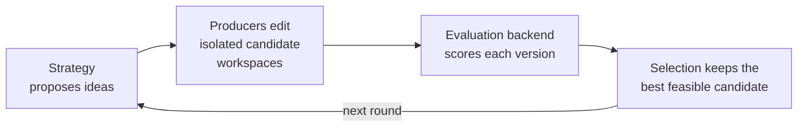

# VeRO: a harness for agents to optimize programs, text, and agents

[](https://arxiv.org/abs/2602.22480)
[](../LICENSE)
[](https://www.python.org/)

VeRO gives an optimizer something to edit, a controlled way to evaluate it, and
durable memory of everything it tried. The target is anything you can put under
Git and score — a **program** (one function to a whole repo), **text** (a prompt,
spec, or config), or an **agent** (its scaffold, tools, and prompts).

VeRO runs the same **version → evaluate → select** loop over all of them. *Where*
each candidate is produced and contained is a swappable backend, and **Harbor is
the recommended one**: it runs the whole coding agent inside a reproducible,
credential-isolated container and scores it against a trusted evaluation sidecar.
That is the right default for optimizing agents and for any untrusted or
reproducibility-critical run. Lighter local backends exist for trusted work that
does not need containment.



## Install

```bash
uv sync --extra optimize        # or --all-extras for the full toolchain
uv run vero --help
```

> Do **not** `pip install scale-vero` from public PyPI — that name is currently an
> unrelated placeholder, not VeRO. Install from this checkout.

Python 3.11–3.13. 3.14 is excluded because litellm does not build there.

## Quickstart

The checked-in C matrix-multiplication example is deterministic and needs **no
model credentials**. Its editable target contains only C; a trusted external
harness compiles it, checks correctness, and measures latency.

```bash
cd examples/c-matmul/target
git init -b main && git add .
git -c user.name=vero -c user.email=vero@localhost commit -m baseline
cd ..

uv run vero evaluate --config vero.toml     # score the baseline
uv run vero run --config vero.toml          # optimize
```

VeRO evaluates the baseline, gives an isolated worktree to the configured
producer, evaluates its commit, selects the faster feasible result, and leaves
the original target untouched.

For a coding-agent run with real search, use
[`examples/circle-packing`](examples/circle-packing/): it asks an agent to improve
a 26-circle packing, exposes exact geometric diagnostics after each authorized
evaluation, and re-scores the selected candidate through a hidden final
evaluation.

## Optimizing an agent (the recommended path)

Compile a build file into a contained task and run a coding agent against it,
with secrets kept off the command line:

```bash
uv run vero harbor run \
  --config build.yaml \
  --agent claude-code --model claude-sonnet-5 \
  --env-file secrets.env
```

Three processes come up, and the separation is the point:

| | holds | never sees |
| --- | --- | --- |
| **Optimizer agent** | the editable target, an `evals` CLI | provider credentials; the test partition; other partitions' cases |
| **Evaluation sidecar** | the cases, scoring, budgets, final selection | — |
| **Inference gateway** | the real provider key | — |

The agent gets a scoped token pointed at the gateway, which enforces a
per-scope model allow-list and token budget. It cannot reach a provider directly,
and it cannot score itself against held-out data.

**→ [docs/guide.md](docs/guide.md) covers this end to end**: the build file, the
gateway, how disclosure and budgets are enforced, and what artifacts a run
leaves behind.

## Which backend

| Backend | Best for | Entry point |
| --- | --- | --- |
| **Harbor** — recommended | optimizing agents; untrusted or reproducibility-critical runs | `vero harbor run` |
| [Command harness](docs/guide.md#optimize-a-program-with-a-command-harness) | any language; a trusted local evaluator driven over versioned JSON | `vero run` |
| [Python tasks](docs/guide.md#python-benchmark-tasks) | Python evaluators via `scale-vero-tasks`, no JSON contract to write | `PythonTaskBackend` |
| [Native in-process](docs/guide.md#python-api) | fast trusted local runs; a coding agent editing a host-bound sandbox | `vero optimize` |

The target and evaluator do not have to be Python: external evaluators and
producers connect over command protocols.

## What you get

| | |
| --- | --- |
| **Any target** | a program, text, or an agent — anything Git-versioned and scoreable |
| **Any producer** | a coding agent (any provider via LiteLLM), an external command, or a custom strategy |
| **Durable and inspectable** | every candidate is versioned and re-selectable; tool calls and evaluations stream to an event log |
| **Population search** | `EvolutionaryStrategy` fans out N offspring per round with tournament selection |
| **Metered** | per-scope token accounting through the gateway, with per-case cost and latency distributions |

## Where things are

| Path | What |
| --- | --- |
| [`docs/guide.md`](docs/guide.md) | the full guide: Harbor, command harness, Python API, tasks, sessions, concepts, safety boundaries |
| [`docs/harbor-architecture.md`](docs/harbor-architecture.md) | how the contained run is assembled, module by module |
| [`docs/agent-setup-guide.md`](docs/agent-setup-guide.md) | getting a coding agent wired up |
| [`examples/`](examples/) | c-matmul (no credentials), circle-packing, harbor-circle-packing, harness-conformance |
| [`src/vero/`](src/vero/) | the library: optimization kernel, runtime, gateway, sidecar, CLI, agent adapters |

For end-to-end agent-optimization benchmarks, see
[`../harness-engineering-bench/`](../harness-engineering-bench/), which also
documents how each coding agent must be pointed at the gateway — the one thing
that reliably costs a run when it is wrong.

## Paper and reproduction

VeRO was introduced in [*VeRO: A Harness for Agents to Optimize
Agents*](https://arxiv.org/abs/2602.22480), accepted at ICML 2026. The paper
studies agent-harness optimization; the current library generalizes the same
version/evaluate/select loop to programs more broadly.

The frozen code for reproducing the paper is preserved on the `paper/v1` branch
and at the `paper-v1` tag:

```bash
git checkout paper-v1
```

The same pre-v0.5 tree is also readable in place under
[`../legacy/`](../legacy/). Note that it is `scale-vero` 0.4.7 and this is 0.5.0,
both importing as `vero`, so they cannot share a virtualenv.

## Development

```bash
uv sync --all-extras
uv run pytest tests/test_v05_*.py
```

VeRO is licensed under the MIT License.
